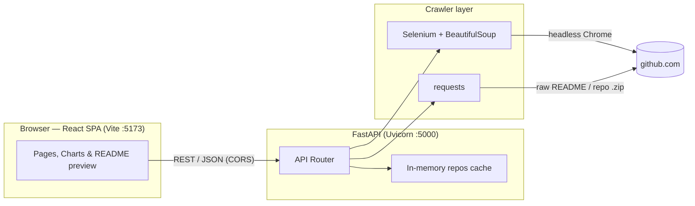
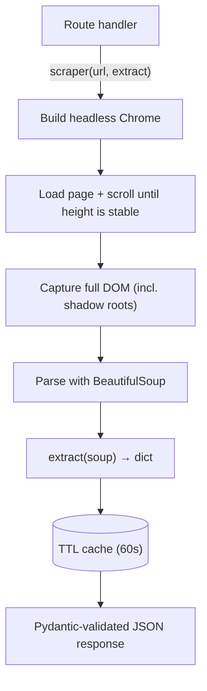
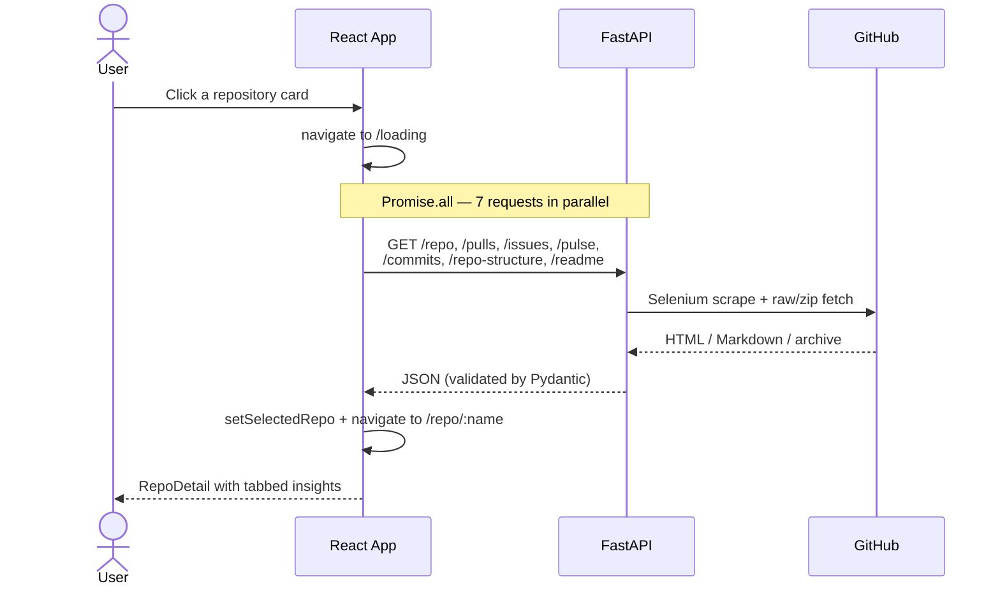
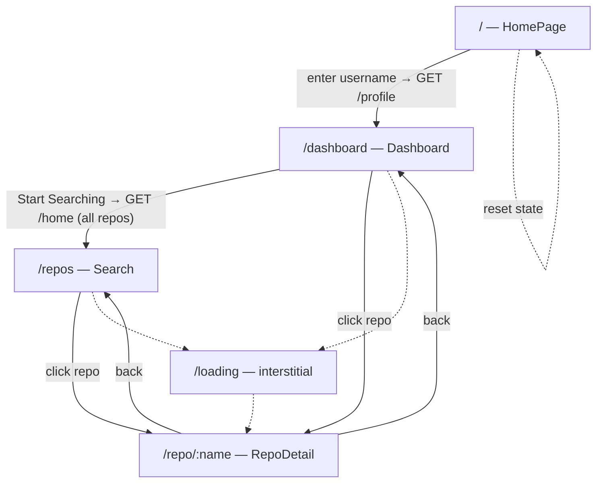

# GitCrawlee

GitCrawlee is a GitHub profile & repository analyzer. Enter any GitHub username and it crawls the public profile, then visualizes repositories, languages, activity, issues/PRs, repo "pulse", file structure, and the rendered README — all in an interactive dashboard.

Because the data is scraped live from GitHub's web UI (no API token required), it works on any public profile without authentication.

---

## Features

- **Profile overview** — followers, following, stars, languages, recent activity.
- **Dashboard charts** — language distribution, activity over time, top starred repos, recency-vs-stars scatter, commit-frequency trend, language radar.
- **Per-repository deep dive** with tabs:
  - **Overview** — stars/forks/watchers/branches, topics, quick stats.
  - **Languages** — doughnut + polar breakdown.
  - **File Structure** — interactive folder explorer (built from the repo archive).
  - **Activity** — commit trend & daily commits.
  - **Issues & PRs** — open/closed comparisons.
  - **Pulse** — recent discussions, merges, additions/deletions.
  - **Analytics** — a computed **Repository Health Score** (activity, consistency, language diversity, community, maintenance, documentation).
  - **Readme** — the repository's README rendered as GitHub-style Markdown.
- **Search** — filter all repositories by keyword or primary language.

---

## Tech Stack

| Layer | Technology |
|-------|-----------|
| Frontend | React 18, Vite, React Router, Tailwind CSS |
| Charts | Chart.js + react-chartjs-2 |
| Markdown | react-markdown + remark-gfm |
| Icons | lucide-react |
| Backend | FastAPI + Uvicorn |
| Scraping | Selenium (headless Chrome) + BeautifulSoup |

---

## Architecture

### System overview



### Crawl pipeline (Selenium routes)

Most endpoints share a single `scraper(url, extract)` helper that drives a headless browser and hands the parsed DOM to a small `extract` function.



> The `/readme` and `/repo-structure` endpoints skip Selenium: they fetch the raw README and the repository `.zip` archive directly with `requests`, which is faster and avoids lazy-loading issues.

### Opening a repository (parallel fan-out)



### Frontend navigation



> Routes other than `/` are guarded — navigating directly (or refreshing) without the required state redirects back to the home page.

---

## Getting Started

### Prerequisites

- **Python 3.10+**
- **Node.js 18+** (npm)
- **Google Chrome** installed — Selenium controls it in headless mode (the matching driver is downloaded automatically by `webdriver-manager`).
- **Git**

### 1. Clone

```bash
git clone https://github.com/HutanshSharma/GitCrawlee.git
cd GitCrawlee
```

### 2. Backend

```bash
python -m venv venv
# Windows
venv\Scripts\activate
# macOS / Linux
source venv/bin/activate

pip install -r requirements.txt
python run.py          # serves the API at http://localhost:5000
```

### 3. Frontend

In a second terminal:

```bash
cd frontend
npm install
npm run dev            # serves the app at http://localhost:5173
```

Open **http://localhost:5173**, enter a GitHub username, and explore.

---

## API Reference

Base URL: `http://localhost:5000`

| Method | Endpoint | Description |
|--------|----------|-------------|
| GET | `/profile/{nickname}` | Profile details + first page of repositories |
| GET | `/home/{nickname}` | All repositories (paginated); cached server-side for search |
| GET | `/search/{keyword}` | Filter cached repos by name/description |
| GET | `/language/{lang}` | Filter cached repos by language |
| GET | `/most_stared` | Top 10 cached repos by star count |
| GET | `/repo/{nickname}/{repository}` | Repo info: stars, forks, watchers, branches, languages, topics |
| GET | `/pulls/{nickname}/{repository}` | Pull request counts (open/closed/labels/milestones) |
| GET | `/issues/{nickname}/{repository}` | Issue counts (open/closed) |
| GET | `/pulse/{nickname}/{repository}` | Pulse summary (merges, discussions, additions/deletions) |
| GET | `/commits/{nickname}/{repository}` | Commit counts grouped by day |
| GET | `/repo-structure/{username}/{repo}` | File/folder tree from the repo archive |
| GET | `/readme/{nickname}/{repository}` | Raw README Markdown |

---

## Notes & Limitations

- **Public, personal accounts only.** Organization profiles aren't supported.
- **Scraping is heavy.** Each repository view fires several headless-browser scrapes, so the first load of a profile or repo can take a little time. Results are cached for 60 seconds.
- **Layout-dependent.** Because data is scraped from GitHub's HTML, significant GitHub UI changes may require updating the `extract` functions in `crawlers/`.
- **Local/dev tool.** It runs against `localhost` with permissive dev CORS and is not hardened for public deployment.
